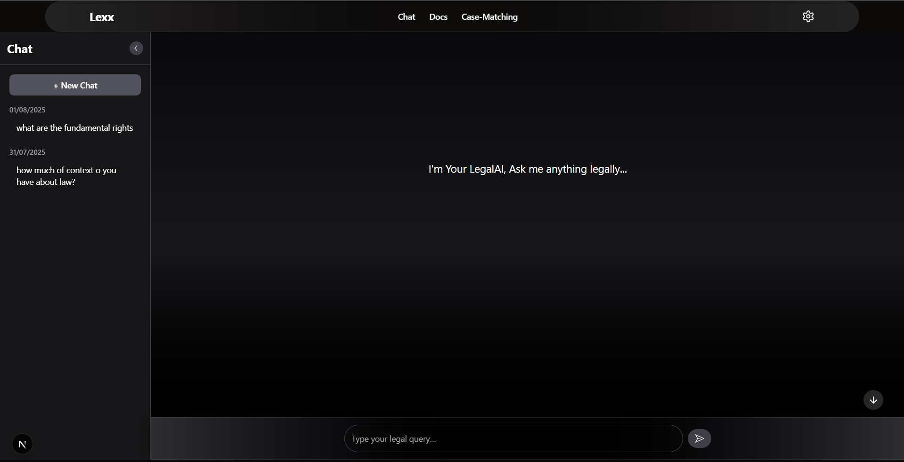
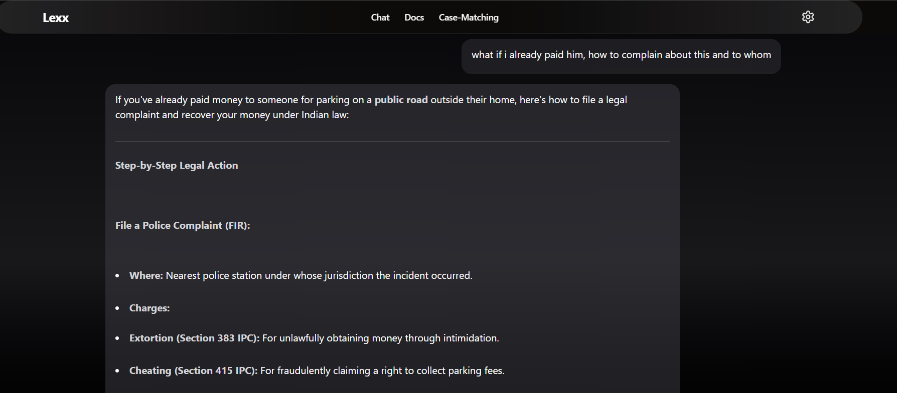
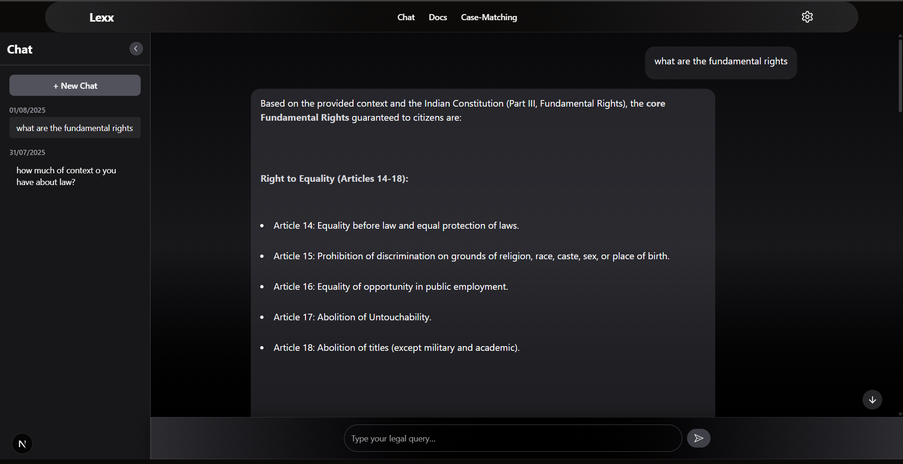
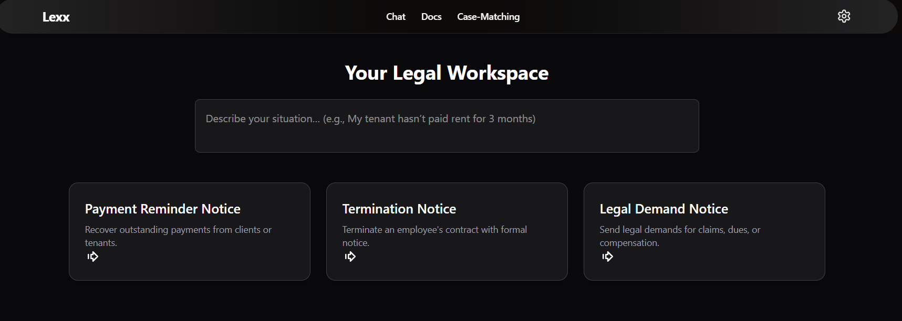
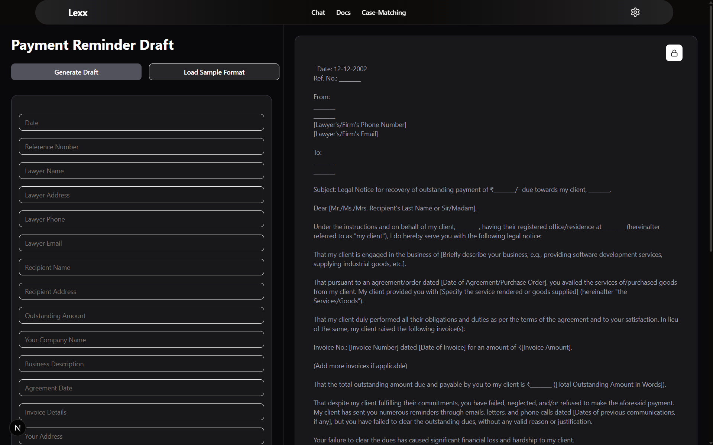

# Lexx - AI-Powered Legal Chat & Research Assistant
Lexx is an LLM + RAG–powered legal AI built for Indian laws.
Ask complex legal questions and get context-aware, citation-backed answers — fast.
Input a few key details, and Lexx auto-generates structured drafts with relevant Act references, ready to export as PDF.

This is my proof-of-work project — a solo effort to streamline legal workflows using AI and automation.

# Features (Beta version)
- Legal Q&A Chat – Get precise answers grounded in Indian statutes, sections, and acts.
- RAG-Powered Context Retrieval – Pulls relevant legal references from a curated knowledge base.
- Act Reference Mapping — Automatically cites relevant Indian Acts for each template.
- Prompt-based Drafting Interface — Simple prompt UI to guide users through document creation.
- Multi-Conversation Support – Keep and revisit separate chat threads.
- Fast & Modern UI – Responsive Next.js frontend, optimized for speed.

<!-- Screenshots gallery -->

  <figure style="margin:0;max-width:320px;text-align:center;">
    
    <figcaption style="margin-top:8px;font-size:13px;color:#9ca3af;">Lexx — Landing page</figcaption>
  </figure>

  <figure style="margin:0;max-width:320px;text-align:center;">
    
    <figcaption style="margin-top:8px;font-size:13px;color:#9ca3af;">Chat section</figcaption>
  </figure>

  <figure style="margin:0;max-width:320px;text-align:center;">
    
    <figcaption style="margin-top:8px;font-size:13px;color:#9ca3af;">Chat — reply view</figcaption>
  </figure>

  <figure style="margin:0;max-width:320px;text-align:center;">
    
    <figcaption style="margin-top:8px;font-size:13px;color:#9ca3af;">Chat — threaded view</figcaption>
  </figure>

  <figure style="margin:0;max-width:320px;text-align:center;">
    
    <figcaption style="margin-top:8px;font-size:13px;color:#9ca3af;">Docs section (WIP)</figcaption>
  </figure>

  <figure style="margin:0;max-width:320px;text-align:center;">
    
    <figcaption style="margin-top:8px;font-size:13px;color:#9ca3af;">Doc editor (WIP)</figcaption>
  </figure>

 # In Progress
Scene-to-Draft Matching – Users will be able to describe a legal scenario in plain language, and Lexx will find the most relevant draft example with maximum specificity, using LLM-powered semantic search + RAG.

  # Tech Stack
- Frontend: Next.js
- Backend: FastAPI
- Database: MongoDB
- AI: OpenRouter API + SentenceTransformers + ChromaDB (RAG)

  # Future Plans
  - LLM-powered Clause Suggestions :Suggest context-aware clauses dynamically based on user inputs.
- Court Judgment Precedents : Integration of past court rulings to enhance draft accuracy.
- Multi-Language Support : Draft legal documents in Hindi and other regional languages.
- Modular Drafting Workflows : Enable users to create custom document flows based on case types.
- Precedent-aware AI Research Assistant : Help users retrieve and summarize relevant case laws.

  # Collaboration & Support
  I'm bootstrapping Lexx solo with midnight maggie and sheer will.
If you're into legal-tech, AI, or just want to support indie builders, feedback and collaboration are always welcome.
- ⭐Star the repo
- Share it
- Drop feedback or ideas
"# Lexx-LegalAI" 
